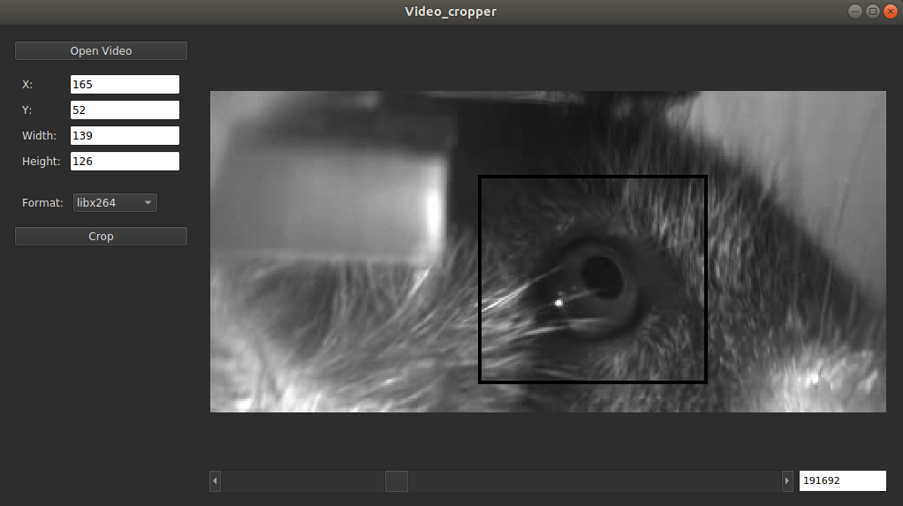

# video_cropper

## Installation
Make sure you've downloaded and installed Anaconda. Unfortunately, this can't be installed with pip, as I've had issues 
installing PySide2 from pip.
* `git clone https://github.com/jbohnslav/video_cropper.git`
* `cd video_cropper`
* `conda env create -f environment.yml`
* `conda activate cropper`
* `python setup.py install`

To encode videos using libx264, please install ffmpeg on your system: [link here](https://ffmpeg.org/download.html)

Note: to install into your own anaconda environment, you'll have to install the dependencies yourself. The most important one is PySide2, which you must install with Anaconda (for some reason): `conda install -c conda-forge pyside2`. the other packages can be installed as normal with pip: `pip install PACKAGENAME`. 

## Usage
Now that it's installed, run the command line anywhere and make sure that the `cropper` env is activated.
Run `python -m video_cropper`

### Using the GUI

* Open videos with the button in the top-left
* Click and drag on the image to create a rectangle. This will be the cropping area
* The current X, Y, width, and height will be displayed in the top-left. To set these to a specific value, edit the text
and then hit `enter`. It will update the cropping area, if possible
* Navigate the video using the scroll bar or the frame number editor
* Change the video format with the drop-down menu. Current supported formats: 
  * libx264: .mp4 using the libx264 encoder, using ffmpeg
  * mjpg: mjpg-encoded .avi using OpenCV
  * HDF5: an HDF5 database of jpeg-encoded bytestrings. Much better random reads than video formats
  * jpeg folder: each image is saved as a .jpg in its own directory. Best random reads, large filesize, and hard to 
  move around

  
  
  
